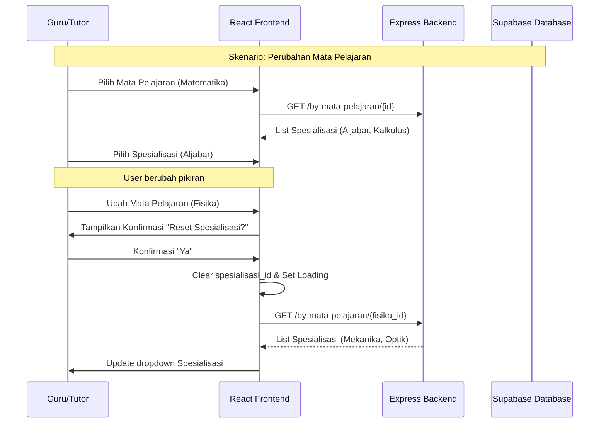

# API Documentation - Sistem Korelasional Spesialisasi

Dokumentasi ini mencakup endpoint API yang digunakan untuk sistem korelasional dinamis antara Mata Pelajaran dan Spesialisasi.

## Base URL
`/api/specializations`

---

## 1. Get All Subjects
Mengambil semua daftar mata pelajaran yang tersedia.

- **Endpoint:** `GET /subjects`
- **Auth:** Not required
- **Response:**
```json
{
  "status": "success",
  "data": [
    {
      "id": "uuid",
      "name": "Matematika"
    },
    {
      "id": "uuid",
      "name": "Fisika"
    }
  ]
}
```

---

## 2. Get Specializations by Subject
Mengambil daftar spesialisasi yang valid untuk mata pelajaran tertentu.

- **Endpoint:** `GET /by-mata-pelajaran/:mataPelajaranId`
- **Auth:** Not required
- **Parameters:**
  - `mataPelajaranId` (UUID): ID mata pelajaran
- **Caching:** In-memory cache with 5 minutes TTL
- **Response (200 OK):**
```json
{
  "status": "success",
  "source": "db", // or "cache"
  "data": [
    {
      "id": "uuid",
      "name": "Aljabar"
    },
    {
      "id": "uuid",
      "name": "Kalkulus"
    }
  ]
}
```
- **Error Responses:**
  - `400 Bad Request`: ID mata pelajaran tidak disediakan.
  - `404 Not Found`: Mata pelajaran tidak ditemukan.

---

## 3. Validate Correlation
Memvalidasi apakah kombinasi mata pelajaran dan spesialisasi valid sebelum penyimpanan data.

- **Endpoint:** `POST /validate`
- **Auth:** Required (Admin/Tutor)
- **Request Body:**
```json
{
  "mataPelajaranId": "uuid",
  "spesialisasiId": "uuid",
  "userId": "uuid" // optional, for logging
}
```
- **Response (200 OK):**
```json
{
  "status": "success",
  "valid": true, // or false
  "message": "Korelasi valid" // or error message
}
```
- **Side Effects:** Jika `valid: false`, sistem akan mencatat percobaan tidak valid ke tabel `correlation_errors`.

---

## 4. Get Correlation Stats
Mengambil statistik error korelasi untuk dashboard monitoring.

- **Endpoint:** `GET /stats`
- **Auth:** Required (Admin)
- **Response (200 OK):**
```json
{
  "status": "success",
  "data": {
    "recent_errors": 12,
    "errors": [
      {
        "id": "uuid",
        "user_id": "uuid",
        "mata_pelajaran_id": "uuid",
        "spesialisasi_id": "uuid",
        "error_type": "invalid_correlation",
        "created_at": "timestamp"
      }
    ]
  }
}
```

---

## 5. Database Level Validation (Safety Net)
Selain validasi via API, sistem memiliki lapisan keamanan di tingkat database menggunakan PostgreSQL Triggers dan Functions.

### Database Trigger: `validate_tutor_correlation_trigger`
- **Table:** `tutors`
- **Timing:** `BEFORE INSERT OR UPDATE`
- **Logic:** Memanggil fungsi `validate_subject_specialization()`. Jika korelasi tidak valid, database akan membatalkan transaksi (`RAISE EXCEPTION`) dan secara otomatis mencatat error ke tabel `correlation_errors` dengan tipe `INVALID_CORRELATION_TRIGGER`.

---

# Diagram Sequence - Penanganan Edge Cases



---

# Troubleshooting Guide

### 1. Spesialisasi Tidak Muncul Setelah Pilih Mata Pelajaran
- **Penyebab:** Network failure atau API timeout.
- **Solusi:** 
  - Cek koneksi internet.
  - Klik tombol "Retry" yang muncul di samping dropdown.
  - Pastikan `VITE_API_URL` di frontend terkonfigurasi dengan benar.

### 2. Error "Spesialisasi yang dipilih tidak tersedia..." saat Submit
- **Penyebab:** Data di frontend tidak sinkron dengan backend atau ada manipulasi form.
- **Solusi:**
  - Refresh halaman.
  - Pastikan memilih spesialisasi dari daftar dropdown yang muncul setelah memilih mata pelajaran.

### 3. Dashboard Monitoring Menunjukkan Lonjakan Error
- **Penyebab:** Serangan bot atau bug pada logika frontend yang mengizinkan submit tanpa validasi.
- **Solusi:**
  - Cek log error di `Admin Activity Log`.
  - Verifikasi tabel `mata_pelajaran_spesialisasi` apakah ada mapping yang hilang.
